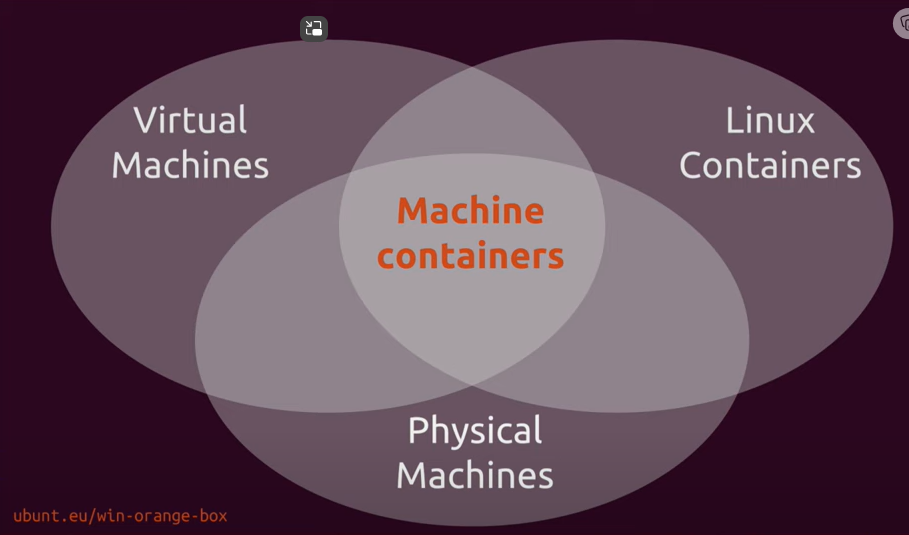

 
 # HPC Container?

 **From this**

 

 **to this?**

 

 First thoughts to build a home lab with LXD on SBC to learn and test a containerized version of a Stockfish cluster.

### Context and first toughts:

 **Containers** play a significant role in the context of **High Performance Computing (HPC)** applications.

1. **Performance Overheads and Portability**:
   - Containers, particularly **OS-level virtualization**, have gained popularity as an alternative to hypervisor-based virtualization. They offer several advantages in HPC environments.
   - From a system administration perspective, containers allow users to define their own software stacks, freeing them from restrictions imposed by the host's pre-configured environment.
   - Containers are of special interest in HPC due to their **potentially low overhead on performance**.
   - They also enhance **portability** and enable **scientific reproducibility**.
   - While performance overhead issues have mostly been addressed, there remains a trade-off between performance and portability. Optimal performance often depends on host-specific optimizations¹.

2. **Complex Dependencies and Customization**:
   - HPC applications often have **complex dependencies** and require specific libraries and software components.
   - Containers help by encapsulating these dependencies in isolated environments, making applications more **compatible and portable**.
   - Users can configure their own customized software environments, reducing the burden on system administrators².

3. **Security and Customization**:
   - HPC systems typically have **higher security levels** compared to cloud systems.
   - Containers allow users to customize their environments, even in secure HPC settings, where traditional software management may be restrictive³.

4. **Container Runtimes**:
   - **Singularity**, initially designed for HPC systems, has become the de facto standard container runtime in this domain⁴.

In summary, containers provide flexibility, performance benefits, and ease of deployment in HPC applications. Their adoption continues to evolve, addressing specific requirements of the field while balancing performance and portability considerations.

# Has LXD any advantage?

Deploying a Stockfish cluster with MPI within LXD containers can be a valid approach to enhance parallel processing. 

Running an operating system (OS) on bare metal refers to installing the OS directly on the physical hardware of a computer. This is the traditional way of setting up a server, where each server runs one instance of an OS. In a cluster of such servers, each server operates independently, though they might be configured to work together to provide a service.

On the other hand, LXD provides system containers and virtual machines that can run full Linux systems. These containers or VMs can run on a single machine or be spread across several machines in a cluster. This allows for better resource utilization as multiple containers or VMs can share the resources of a single machine. 

Here are some key differences between the two approaches:

1. **Resource Utilization**: LXD containers have less overhead than a full OS, allowing for more efficient use of system resources². This means you can run more containers on a given set of hardware than you could with full OS installations.

2. **Scalability**: With LXD, you can easily add more containers or VMs to handle increased load, and these can be spread across several machines in a cluster⁵. This is more flexible than adding more servers to a cluster.

3. **Isolation**: Each LXD container or VM provides an isolated environment, similar to a full OS installation. This can improve security and make it easier to manage different applications².

4. **Management**: LXD provides a unified way to manage system containers and VMs, whether they're running on a single machine or spread across a cluster⁵. This can be simpler than managing a cluster of servers each with its own OS.

5. **Portability**: Containers are generally more portable than full OS installations. A container running on one machine can usually be easily moved to another machine.

6. **High Availability**: In a LXD cluster, if one node fails, the containers it was running can be restarted on another node⁶. This is not easily achievable with traditional OS on bare metal.

In summary, while running an OS on bare metal might be suitable for certain use cases, using LXD containers or VMs can provide advantages in terms of resource utilization, scalability, isolation, management, portability, and high availability. The choice between the two would depend on the specific requirements of your use case.

# Thoughts:
- If LXD runs a VM over several machines in a LXD cluster, can I use Stockfish as is to be executed?
- If using the Stockfish cluster version with MPI and install on each machine in the container, has this an advantage?

## Pros
Stockfish Cluster:

Stockfish is a powerful open-source chess engine known for its strength and ability to analyze positions deeply.

Creating a Stockfish cluster involves distributing chess engine computations across multiple nodes to improve overall performance.

### MPI (Message Passing Interface):

**MPI** is a standard for parallel programming in distributed memory systems. It allows processes to communicate and coordinate, enabling parallel processing.

### Containers with LXD:

**LXD** provides lightweight system containers and virtual machines that can run full Linux systems.
Containers offer isolation and ease of deployment, making them suitable for parallelizing applications like Stockfish.

**Enhancing Parallel Processing:**

**Deploying Stockfish within LXD** containers with MPI can potentially enhance parallel processing.

**MPI allows Stockfish instances running in different containers** to exchange messages and collaborate on chess analysis, leveraging the distributed computing capabilities.

**Performance Advantages:**

The use of MPI in containers could provide performance advantages, especially for computationally intensive tasks like chess analysis.
Parallel processing can lead to faster evaluations of multiple positions simultaneously, potentially improving overall throughput.

## Cons

**Communication Overhead**: While MPI facilitates communication between processes, there may be some overhead associated with inter-container communication. Efficient implementation and network considerations are crucial.

**Scalability:** The effectiveness of parallel processing depends on factors like workload distribution, the number of nodes, and the nature of the chess positions being analyzed.

**Resource Utilization:** Ensuring optimal utilization of resources within each container and effective load balancing across containers is important.

**Configuration and Tuning:** Proper configuration of Stockfish and MPI settings within containers, along with tuning for the specific hardware and workload, is essential for achieving the desired performance benefits.

## LXD with MAAS

MAAS, which stands for "Metal as a Service", is a service that allows you to treat physical servers like virtual machines in the cloud. It turns your bare metal into an elastic, cloud-like resource that you can easily provision, monitor, and manage. 

With MAAS, you no longer need to manage individual servers manually. Instead, you can enlist bare metal servers and deploy standard or customized operating systems to them remotely. This allows you to rapidly deploy, destroy, and reconfigure your physical servers as needed.

Some key features of MAAS include:
- Automated remote operating system deployment to physical machines
- Ability to manage large fleets of physical servers as a flexible resource pool
- Monitoring and management of physical infrastructure from a central interface
- Rapid provisioning and tear down of bare metal server configurations

MAAS also provides super-fast self-service provisioning of Windows, Ubuntu, CentOS, and ESXi. It implements all the standard features of a public cloud — like instance metadata and cloud-init¹. Your customers get complete control of the deployed machine¹. Canonical, the creator of cloud-init, ensures that MAAS provides a first-class cloud experience for physical servers based on x86, ARM64, POWER, and Z architectures.

Source:

1. Containers in HPC: a survey | The Journal of Supercomputing - Springer. https://link.springer.com/article/10.1007/s11227-022-04848-y
2. Containers and HPC: Mutually Beneficial - Cloud Native Now. https://cloudnativenow.com/topics/cloudnativeplatforms/containers-hpc-mutually-beneficial/
3. Containerization for High Performance Computing Systems: Survey and .... https://ieeexplore.ieee.org/document/9985426/
4. Container orchestration on HPC systems through Kubernetes. https://journalofcloudcomputing.springeropen.com/articles/10.1186/s13677-021-00231-z

5. About clustering - Canonical LXD documentation. https://documentation.ubuntu.com/lxd/en/latest/explanation/clustering/.
6. Run system containers with LXD | Ubuntu. https://ubuntu.com/lxd.
7. Please explain advantages of LXD cluster over regular LXD. https://discuss.linuxcontainers.org/t/please-explain-advantages-of-lxd-cluster-over-regular-lxd/3554.
8. Bare metal Kubernetes: The 6 things you wish you knew before 2022 - MAAS. https://maas.io/blog/6-things-you-wish-you-knew-about-bare-metal-kubernetes-before-2022.
9. Nova-LXD delivers bare-metal performance on OpenStack, while ... - Ubuntu. https://ubuntu.com/blog/nova-lxd-delivers-bare-metal-performance-on-openstack-while-ironic-delivers-nsa-as-a-service
10. Bare Metal vs. RTOS vs. OS: What Works Best for IoT? - Nabto. https://nabto.com/bare-metal-vs-rtos-vs-os/
11. Inexpensive highly available LXD cluster: Introduction. https://stgraber.org/2020/12/15/inexpensive-highly-available-lxd-cluster-introduction/
12. Kubernetes vs LXD | TrustRadius. https://www.trustradius.com/compare-products/kubernetes-vs-linux-containers-lxd
13. MAAS | MAAS documentation. https://maas.io/docs.
14. MAAS | Metal as a Service. https://maas.io/.
15. Metal as a Service (MaaS): DIY server-management at scale. https://engineering.linkedin.com/blog/2023/metal-as-a-service--maas---diy-server-management-at-scale.
16. what is maas exactly? - Ask Ubuntu. https://askubuntu.com/questions/486701/what-is-maas-exactly