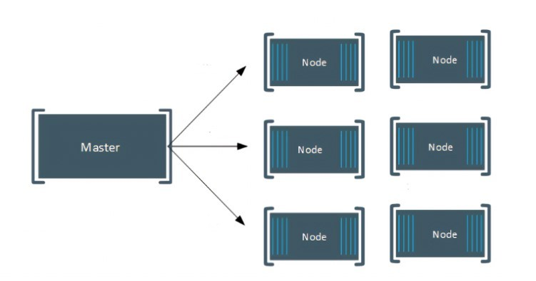

# Setup Stockfish Cluster
<h2>I. Getting ready for a SBC cluster</h2>
The Raspberry Pi 3 and higher is built with a 64-bit chip. Yet the Raspberry Pi Foundation has only released 32bit Linux distributions so far, but since March 2022 there is a 64-bullseye distribution. Replacing my existing Pi's with Le Potato I switched to Ubuntu server 64-bit images. Performance is way higher than with 32-bit images. However, recently I had a clash after Ubuntu update and switched to the very stable Armbian distribution for LePotato.
If you want to use Debian, start by downloading the latest version of Raspbian, the Debian distribution that runs on the Pis. Download the command-line only “lite” version to save space and create Image with raspberry PI Imager, Debian Lite. Before we finish with the SD card, we want to enable SSH remote access from our Pi. To do this, open the “boot” drive on the SD card and create an empty file named ssh with no extension. Create an empty via file with windows CMD with: copy nul “ssh” and voila, the file is created and named ssh (no extension) and copy to sd card.
Repeat with all SD cards for each node and don’t mix them up. Boot raspberry PI and login via SSH, user “pi”, password “raspberry” and run the updates. With Ubuntu or Armbian this is not necessary. Headless SBC installation is way easier.
The first installation will be our ClusterMaster.
After first login, update the system

```console
$ sudo apt-get update
$ apt-get upgrade -y
```
Setting up the ClusterMaster:
```console
$ hostnamectl set-hostname new-hostname
```
or
```console
$ sudo nano /etc/hostname and reboot
```
Additionally, I had to change the file /etc/cloud/cloud.cfg in the Ubuntu OS. There is a setting preserve_hostname: false and I had to change that from false to true.
Next step is to add a new user -in this example *mpiuserer* - we want to use to run the Stockfish Cluster:
```console
$ adduser mpiuser
```
and add to sudoer group
```console
$ usermod -aG sudo mpiuser
```
It's easier to run sudo command without password. Therfore, login as newuser and get rid of password when entering sudo command with

```console
$ sudo bash -c 'echo "$(logname) ALL=(ALL:ALL) NOPASSWD: ALL" | (EDITOR="tee -a" visudo)'
```
Repeat this for all your nodes, name them such as CluserNode1-3, having this picture in mind.


a) The ClusterMaster has now the basic setup. Repeat for CluserNode1-3. Now all nodes are ready and we need to ensure ClusterMaster can talk to each node.
1. Create ssh key on ClusterMaster:
```console
$ ssh-keygen -t rsa
```
2. copy the key to each node
From ClusterMaster to ClusterNode1-3
```console
$ ssh-copy-id remote-user@server-ip
```
b) ClusterNode1-3 need to talk to ClusterMaster
1. Create ssh key on ClusterNode1-3
```console
$ ssh-keygen -t rsa
```
2. copy the key to each node
From ClusterNode1-3 to ClusterMaster
```console
$ ssh-copy-id remote-user@server-ip
```
c) In the third step you want to enable the login from your windows machine via SSH and without password too.
From Windows Powershell to Linux Machine

1. create ssh key
```console
$ cat ~/.ssh/id_rsa.pub
```

2. to copy the key, login to ClusterMaster, ClusterNode1-3
```console
 $ cd .ssh
 $ nano authorized_keys
 ```
and paste the key from Windows in a new line
Done, the basic cluster is setup, the master can talk to the worker nodes and vice versa.
to exececute tasks

<h2>II. Managing the Cluster</h2>
There are multiple options available for managing a compute cluster, such as Ansible or Fabric. However, a quick and easy-to-use option is parallel-ssh, an asynchronous parallel SSH library designed for large-scale automation. 
It differs from alternatives and higher-level frameworks such as Ansible in the following ways:

- Scalability: It can scale to hundreds, thousands, tens of thousands of hosts or more.
- Ease of use: Running commands over any number of hosts can be achieved with just a few lines of code.

To install parallel-ssh, run the following command in your terminal:

```console
$ sudo apt install parallel-ssh
```

Next, create a file named .pssh_hosts using the nano text editor:

```console
$ nano .pssh_hosts
```
In the .pssh_hosts file, add the host names for your cluster nodes, such as:

```
ClusterNode1
ClusterNode2
ClusterNode3
```
With the .pssh_hosts file in place, you can now execute commands on multiple hosts at once using parallel-ssh. For example:

```
$ parallel-ssh -i -h .pssh_hosts sudo apt-get update
$ parallel-ssh -i -h .pssh_hosts sudo apt-get upgrade -y
```
You can also run scripts using parallel-ssh.

Another option which you can also use to deploy on Azure compute cluster is `clush`, a very easy to handle managing tool.
``` console
$ sudo apt install clustershell
```

Example usage:
``` console
$ clush -w node[1-3] -b
Enter 'quit' to leave this interactive mode
Working with nodes: node[1-3]
clush> uname
clusternode1: Linux
clusternode3: Linux
clusternode2: Linux

$ clush -v -w clusternode[1-3] --copy /home/mpi/helloworld.py
`/home/mpi/helloworld.py' -> clusternode[1-3]:`/home/mpi/'
clush> quit
```


<h2>Python3-mpi4py” package</h2>
Not mandatory, but it might be a good idea to install MPI4PY. Mpi4py is a Python package that implements the Message Passing Interface (MPI) standard. It is built on top of the MPI specification and provides an API based on the standard MPI-2 C++ bindings. This library may be installed using both the pip manager and the apt packager. Python2 and Python3 are supported via the Mpi4py package. It supports convenient communication of any pickable python object, fast communication, parallel input and output, dynamic process management, etc.

```console
$ sudo apt install python3-pip
```
And then using pip to install mpi4py
```console
$ sudo apt install python3-mpi4py
```
We might want to use some python scripts to test things out such as MPI configuration.
